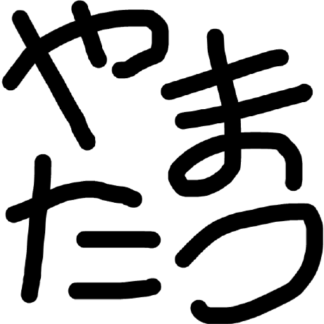

このスライドのコード

https://github.com/yamatatsu/slide-jawsug-cdk-4th
---
<dev style="display: flex; justify-content: center; align-items: center; margin-top: 40px;">
  
  <ul style="list-style-type: none; line-height: 1.4">
    <li style="font-size: 36px; font-weight: 700;">山本達也（やまたつ）</li>
    <li style="font-size: 20px; margin-bottom: 0px;">クラスメソッド株式会社</li>
    <li style="font-size: 20px; margin-bottom: 16px;">CX事業本部 デリバリー部</li>
    <li style="font-size: 20px; margin-bottom: 0px;">
      <a href="https://twitter.com/yamatatsu193">Twitter: @yamatatsu193</a>
    </li>
    <li style="font-size: 20px; margin-bottom: 16px;">
      <a href="https://github.com/yamatatsu">GitHub: @yamatatsu</a>
    </li>
    <li style="font-size: 20px; margin-bottom: 8px;">
      コミュニティ活動:
      <ul style="list-style-type: disc">
        <li>JAWS-UG CDK支部</li>
      </ul>
    </li>
    <li style="font-size: 20px; margin-bottom: 8px;">
      OSSコントリビューション:
      <ul style="list-style-type: disc">
        <li>aws-cdk</li>
      </ul>
    </li>
  </ul>
</dev>
