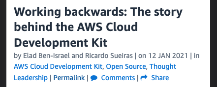

### 目次

- きっかけ
- CDKの始まりを見てみよう
- 年表
- さいごに

---

# きっかけ

---
CDKの作者が書いたブログ （[リンク](https://aws.amazon.com/jp/blogs/opensource/working-backwards-the-story-behind-the-aws-cloud-development-kit/)）

 <!-- .element: height="160px" -->  

---

###  背景

数年前、Eladさんたちは私たちはホットなトレンド商品をより良く特定するために、検索サービスを再構築していました。
この新しいイベント駆動型アーキテクチャは、AWSのグローバルインフラストラクチャの複数の環境に展開されたAWSサービス（例えば、Amazon DynamoDB、AWS Lambda、Amazon Kinesisなど）を使って構築されました。
チームは、これをモジュール方式でアーキテクチャーと構築を行い、分離して開発とテストを行い、必要に応じて独立して進化させることを望んでいました。

---

### 課題

AWS CloudFormationを使っていました。
AWS CloudFormationはリソースをプロビジョニングするための正しいツールでしたが、チームは**YAML/JSONを使うことは彼らのシステムを記述するための正しいアプローチではないと感じていました。**
AWS CloudFormationのテンプレートは、基本的にリソースとその構成のフラットなリストです。インジェクションパイプライン "や "ストレージレイヤー"、"dynamodbスキャナ "などの抽象的なアイデアを表現するためのツールは含まれていないのです。

---

### 解決策

チームは自分たちを制限するのではなく、**AmazonのInvent and Simplifyの原則**に従って、AWS CloudFormationの力を使いながら、JSONの代わりにJavaを使用できる高レベルのオブジェクト指向の抽象化を考え出しました。
そして、個々のAWSリソースをモデル化したクラスを作成し、「コンストラスト」と呼ばれるプログラミングモデルを使って、これらを再利用可能な高レベルの概念に素早く組み上げることができた。
さらに、**このアプローチにより、アプリケーションとインフラに同じプログラミング言語を使用することが可能になり、開発者の学習曲線が短縮され、ユニットテストなどの技術を使用して品質を向上させることができるようになった。**
**このプロジェクトは予定より早く納品され、AWS CDKの作成につながるアプローチの概念実証となりました。**

---

### そしてCDKへ

チームは、このプロジェクトを成功に導くために、他の方針も採用しました。そのひとつが、「開発者がどこにいても対応できるようにする（**meeting developers where they are**）」という考え方です。
そのために、お客様が使う複数のプログラミング言語をどうサポートするかを検討しました。
そして、**このアプローチは、チームが作成した別のオープンソース技術であるjsii (the JavaScript Interop Interface)の開発につながりました。**
これにより、AWS CDKの抽象化を一度（TypeScriptで）書き、それを複数のプログラミング言語に公開することができるようになりました。
(詳しくはブログ記事「How the jsii open source framework meets developers where they are」をお読みください)。

---

それではCDKの始まりを見てみましょう

---

CDKの最初のコミット

---

2017-10-05

---

https://github.com/aws/aws-cdk/commit/b2073c40df5eb54852359a852ecdbef4ddf69d77

---

_The AWS CDK is a rich class library for building services on top of the AWS Cloud. CfnObjects is the base layer of the CDK, providing language bindings to CloudFormation resources._

---

2回目のコミット

---

2018-05-30

---

なぜ半年以上も。。🤔

<!-- TODO: JSII の話をnoteに書くか？ -->

---

https://github.com/aws/aws-cdk/commits/b470492fa1babfd7528d73d429d6eea36c5f2d39/packages

---

<section data-auto-animate>

- 2019-07 **v1** GA
- 2020-07 **CDK Pipelines** Preview
- 2021-04 **v2 and go** Developer Preview

</section>
<section data-auto-animate>

- 2019-07 **v1** GA
- 2020-07 **CDK Pipelines** Preview
- 2021-04 **v2 and go** Developer Preview
- 2021-07 **CDK Pipelines** GA

</section>
<section data-auto-animate>

- 2019-07 **v1** GA
- 2020-07 **CDK Pipelines** Preview
- 2021-04 **v2 and go** Developer Preview
- 2021-07 **CDK Pipelines** GA
- 2021-09 **hot swap**

</section>
<section data-auto-animate>

- 2019-07 **v1** GA
- 2020-07 **CDK Pipelines** Preview
- 2021-04 **v2 and go** Developer Preview
- 2021-07 **CDK Pipelines** GA
- 2021-09 **hot swap**
- 2021-10 **cdk8s** GA

</section>
<section data-auto-animate>

- 2019-07 **v1** GA
- 2020-07 **CDK Pipelines** Preview
- 2021-04 **v2 and go** Developer Preview
- 2021-07 **CDK Pipelines** GA
- 2021-09 **hot swap**
- 2021-10 **cdk8s** GA
- 2021-12 **v2** GA

</section>
<section data-auto-animate>

- 2019-07 **v1** GA
- 2020-07 **CDK Pipelines** Preview
- 2021-04 **v2 and go** Developer Preview
- 2021-07 **CDK Pipelines** GA
- 2021-09 **hot swap**
- 2021-10 **cdk8s** GA
- 2021-12 **v2** GA
- 2021-12 **Construct Hub** GA

</section>

---

さいごに

---

AWS Global Summit Online 2020 の Keynote で CTO の Werner氏はこのように語っています。

---

_**I expect the cdk to become**_  
_**the developer preferred approach**_  
_**for building and configuring**_  
_**cloud services and other complex systems.**_

https://youtu.be/AYYTrDaEwLs?t=909

Note:
最初に紹介したブログにもありますが、2020 AWS Summit Online Americasのキーノートで、AmazonのCTOであるWerner Vogels氏は基調講演でこう述べました。
cdkの基礎であるconstructsという抽象化によって、cdkはAWSに限らないさまざまなリソースを構築することができます。
このあとで紹介される cdktf や cdk8s 、また construct hub で公開されている datadog, github。
